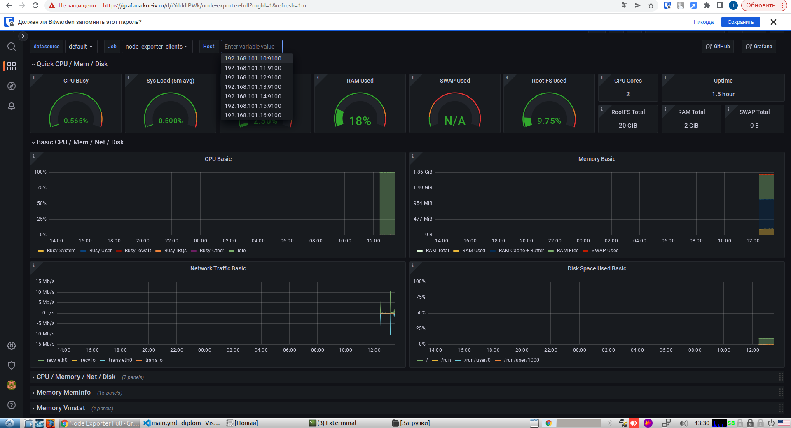

# Дипломный практикум в YandexCloud
## Студент: Корючкин Илья Вячеславович
### Цели:
1. Зарегистрировать доменное имя (любое на ваш выбор в любой доменной зоне).
2. Подготовить инфраструктуру с помощью Terraform на базе облачного провайдера YandexCloud.
3. Настроить внешний Reverse Proxy на основе Nginx и LetsEncrypt.
4. Настроить кластер MySQL.
5. Установить WordPress.
6. Развернуть Gitlab CE и Gitlab Runner.
7. Настроить CI/CD для автоматического развёртывания приложения.
8. Настроить мониторинг инфраструктуры с помощью стека: Prometheus, Alert Manager и Grafana.

### Этапы выполнения:

#### 1. Регистрация доменного имени
Зарегистрирован домен kor-iv.ru у регистратора reg.ru.

Имеется возможность выписывать TLS сертификаты для веб-сервера.

Имеется доступ к личному кабинету на сайте регистратора.

  

#### 2. Создание инфраструктуры

Подготовлена инфраструктура в YC при помощи Terraform. Все необходимое содержится в папке: [infrastructure](адрес "Описание")

Создан сервисный аккаунт, который будет в дальнейшем использоваться Terraform для работы с инфраструктурой с необходимыми и достаточными правами. 
Подготовлен backend для Terraform S3 bucket в созданном YC аккаунте:

  

Настроены workspaces. Использован один workspace с наименованием stage.

Созданы VPC с подсетями в разных зонах доступности. Имеется возможность выполнить команды terraform destroy и terraform apply без дополнительных ручных действий.

Terraform сконфигурирован и создание инфраструктуры посредством Terraform возможно без дополнительных ручных действий.

  

#### 3. Установка Nginx и LetsEncrypt

Разработана Ansible роль для установки [Nginx и LetsEncrypt](адрес "Описание").
Для получения LetsEncrypt сертификатов во время тестов кода использованы тестовые сертификаты.

* Имя сервера: kor-iv.ru
* Характеристики: 2vCPU, 2 RAM, External address (Public) и Internal address.

Создан reverse proxy с поддержкой TLS для обеспечения безопасного доступа к веб-сервисам по HTTPS.
В зоне настроены все A-записи на внешний адрес этого сервера:
* https://www.kor-iv.ru (WordPress)
* https://gitlab.kor-iv.ru (Gitlab)
* https://grafana.kor-iv.ru (Grafana)
* https://prometheus.kor-iv.ru (Prometheus)
* https://alertmanager.kor-iv.ru (Alert Manager)

Настроены все upstream для выше указанных URL.

В браузере можно открыть любой из этих URL и увидеть ответ сервера.

#### 4. Установка кластера MySQL

Разработана Ansible роль [mysql](адрес "Описание") для установки кластера MySQL.

* Имена серверов: db01.kor-iv.ru и db02.kor-iv.ru
* Характеристики: 4vCPU, 4 RAM, Internal address.

Получен отказоустойчивый кластер баз данных MySQL.

* В кластере автоматически создаётся база данных c именем wordpress.
* В кластере автоматически создаётся пользователь wordpress с полными правами на базу wordpress и паролем wordpress.
* MySQL работает в режиме репликации Master/Slave.

#### 5. Установка WordPress

Разработана Ansible роль [wordpress](адрес "Описание") для установки WordPress.

* Имя сервера: app.kor-iv.ru
* Характеристики: 4vCPU, 4 RAM, Internal address.

Создана виртуальная машина на которой установлен WordPress и Apache.

* В доменной зоне настроена A-запись на внешний адрес reverse proxy: https://www.kor-iv.ru (WordPress)
* На сервере kor-iv.ru отредактирован upstream для выше указанного URL и он смотрит на виртуальную машину на которой установлен WordPress.
* В браузере можно открыть URL [https://www.kor-iv.ru](адрес "Описание") и увидеть главную страницу WordPress.

  

#### 6. Установка Gitlab CE и Gitlab Runner
Разработана Ansible роль [gitlab](адрес "Описание") для установки gitlab-ce и gitlab-runner. Настроена CI/CD система для автоматического развертывания приложения при изменении кода.
* Имена серверов: gitlab.kor-iv.ru и runner.kor-iv.ru
* Характеристики: 4vCPU, 4 RAM, Internal address.

Построен pipeline доставки кода в среду эксплуатации, то есть настроен автоматический деплой на сервер app.kor-iv.ru при коммите в репозиторий с WordPress.
* Интерфейс Gitlab доступен по https.
* В доменной зоне настроена A-запись на внешний адрес reverse proxy: https://gitlab.kor-iv.ru (Gitlab)
* На сервере kor-iv.ru отредактирован upstream для выше указанного URL и он смотрит на виртуальную машину на которой установлен Gitlab.
* При любом коммите в репозиторий с WordPress и создании тега (например, v1.0.0) происходит деплой на виртуальную машину.

  

  

#### 7. Установка Prometheus, Alert Manager, Node Exporter и Grafana

Разработана Ansible роль [monitoring](адрес "Описание") для установки Prometheus, Alert Manager и Grafana.
* Имя сервера: monitoring.kor-iv.ru
* Характеристики: 4vCPU, 4 RAM, Internal address.

Получены метрики со всей инфраструктуры. Интерфейсы Prometheus, Alert Manager и Grafana доступены по https.В доменной зоне настроены A-записи на внешний адрес reverse proxy:
* https://grafana.kor-iv.ru (Grafana)
* https://prometheus.kor-iv.ru (Prometheus)
* https://alertmanager.kor-iv.ru (Alert Manager)

На сервере kor-iv.ru отредактированы upstreams для выше указанных URL и они смотрят на виртуальную машину на которой установлены Prometheus, Alert Manager и Grafana. На всех серверах, с помощью соответствующих ролей, установлен Node Exporter.

* Метрики всех Node Exporter доступны Prometheus.

  

* У Alert Manager есть необходимый набор правил для создания алертов.

  

* У alertmanager имеется правило оповещения в указанную электронную почту при недоступности Node Exporter по всем серверам.

  

* В Grafana есть дашборд отображающий метрики из Node Exporter по всем серверам.

  

